# 🌿 Parcial 1: Caso Práctico — Selección de Stack, Arquitectura de Software y Despliegue
### Ingeniería de Software II — Corporación Universitaria Lasallista


---

## 👨‍💻 Información del Estudiante
- **Nombre:** Jerónimo Mesa
- **Curso:** Ingeniería de Software II
- **Institución:** Corporación Universitaria Lasallista
- **Repositorio Base Original:** [https://github.com/g3in-unilasallista/mi_proyecto_python.git](https://github.com/g3in-unilasallista/mi_proyecto_python.git)
- **Repositorio Fork (Personal):** [https://github.com/Jero1211/Parcial-1-Jer-nimo-Mesa-](https://github.com/Jero1211/Parcial-1-Jer-nimo-Mesa-)
- **Rama de Trabajo:** `feature/quiz-arquitectura-jeronimo`

---

## 📋 Respuestas de la Evaluación Práctica

---

### 1. Selección del Stack y Arquitectura de Software

| Elemento | Respuesta del estudiante |
| :--- | :--- |
| **Lenguaje de programación** | Python (v3.13) |
| **Framework backend** | Flask (v3.1.3) |
| **Tecnologías frontend** | HTML5 semántico, CSS3 moderno (Variables CSS, Glassmorphism, animaciones fluidas) y JavaScript (ES6+ nativo) |
| **Base de datos o almacenamiento** | Estructuras de datos en memoria (In-Memory / JSON en cliente y backend) |
| **Arquitectura o patrón seleccionado** | Arquitectura Monolítica basada en el patrón MVT / MVC (Model-View-Template) |
| **Servicio de despliegue** | Render (PaaS - Web Service con servidor WSGI Gunicorn) |

#### 📝 Justificación de la selección de la arquitectura y del stack tecnológico:
> *"Se seleccionó Python junto con el micro-framework Flask debido a su minimalismo, bajo acoplamiento y rapidez para implementar aplicaciones web dinámicas con bajo consumo de memoria. La arquitectura monolítica basada en MVC/MVT resulta idónea para este alcance, pues centraliza en un único paquete de despliegue la lógica del controlador (`app.py`) y la interfaz visual (`templates/index.html`), minimizando la sobrecarga operativa y los costos de infraestructura.*
> 
> *En la capa de presentación (Frontend), el uso de HTML5, CSS3 moderno y JavaScript vanilla permite ofrecer una interfaz reactiva, moderna y con efectos Glassmorphic para el quiz interactivo sin necesidad de dependencias externas pesadas como React o Angular. Finalmente, se seleccionó Render como plataforma PaaS en conjunto con el servidor WSGI Gunicorn debido a su integración continua nativa con GitHub, soporte directo para Python y su capacidad de gestionar tráfico web en entornos de producción con procesos trabajadores (workers) concurrentes."*

---

### 2. Análisis de la Estructura del Proyecto

#### 📂 Estructura de archivos y directorios:
```text
Parcial-1-Jer-nimo-Mesa-/
├── app.py                 # Controlador principal y enrutamiento backend con Flask
├── requirements.txt       # Declaración de dependencias (Flask, gunicorn)
├── Procfile               # Configuración de comando de inicio para Render (web: gunicorn app:app)
├── LICENSE                # Licencia MIT del proyecto
├── README.md              # Documentación técnica y respuestas del parcial
├── templates/
│   └── index.html         # Vista (Jinja2/HTML5) con diseño Glassmorphic, tarjeta de autor y Quiz
└── venv/                  # Entorno virtual de ejecución local de Python
```

#### 🏛️ Arquitectura identificada & Justificación:
> *"Se identifica una **Arquitectura Monolítica Liviana** estructurada bajo el patrón **MVT/MVC (Modelo-Vista-Template)** nativo de Flask:*
> - *`app.py` asume la responsabilidad de **Controlador / Enrutador**, recibiendo las peticiones HTTP y despachando las respuestas correspondientes.*
> - *`templates/index.html` asume el rol de **Vista**, encapsulando la presentación, maquetación, estilos visuales y la lógica de interacción del cliente.*
> - *El estado del quiz y la configuración operan como un **Modelo en memoria**, desacoplado de bases de datos pesadas.*
> 
> *Esta arquitectura es óptima para aplicaciones de evaluación y aprendizaje rápido, ya que garantiza un despliegue directo, alta velocidad de renderizado y facilidad de mantenimiento sin incurrir en la latencia de red ni en la complejidad que implicarían servicios distribuidos."*

---

### 3. Implementación del Quiz Interactivo

El módulo interactivo fue desarrollado dentro de `templates/index.html` bajo una estética armónica con la naturaleza (Glassmorphism, tonos verdes `#52b788`, dorados `#e9c46a` y modo oscuro).

#### ✨ Características funcionales incluidas:
1. **Pregunta técnica principal formulada:**
   > *¿Cuál es la principal característica y objetivo de la Arquitectura Hexagonal (Puertos y Adaptadores)?*
2. **Opciones de respuesta (4 opciones):**
   - A) Acoplar directamente la lógica de negocio al motor de base de datos para optimizar la velocidad de consulta.
   - **B) Aislar el núcleo de la lógica de negocio (dominio) del exterior mediante puertos (interfaces) y adaptadores, permitiendo cambiar bases de datos o frameworks sin alterar el dominio. [CORRECTA]**
   - C) Dividir obligatoriamente la aplicación en exactamente seis capas físicas distribuidas en diferentes servidores.
   - D) Evitar el uso de interfaces de programación de aplicaciones (APIs) y utilizar únicamente archivos de texto plano.
3. **Identificación visual:** Resaltado de la tarjeta seleccionada mediante borde dorado y sombreado brillante.
4. **Retroalimentación inmediata (Feedback):** Panel dinámico que indica si la opción fue correcta (verde) o incorrecta (rojo/naranja) con su respectiva argumentación técnica y pedagógica.
5. **Progreso y Puntuación:** Contador dinámico de preguntas y pantalla final con conteo de aciertos y mensaje de desempeño.

---

### 4. Control de Versiones y Rama de Trabajo

Se implementó el flujo de trabajo recomendado con ramas en Git:
- **Rama creada:** `feature/quiz-arquitectura-jeronimo`
- **Comandos ejecutados:**
  ```powershell
  # Crear y cambiar a la rama de trabajo
  git checkout -b feature/quiz-arquitectura-jeronimo

  # Preparar y confirmar los cambios
  git add templates/index.html README.md
  git commit -m "feat: seccion creativa de Jeronimo Mesa y quiz interactivo sobre arquitecturas de software"

  # Publicar la rama en el repositorio remoto
  git push -u origin feature/quiz-arquitectura-jeronimo
  ```

---

### 5. Creación del Pull Request

- **Repositorio Destino:** `https://github.com/g3in-unilasallista/mi_proyecto_python.git` (`main`)
- **Repositorio Origen:** `https://github.com/Jero1211/Parcial-1-Jer-nimo-Mesa-.git` (`feature/quiz-arquitectura-jeronimo`)
- **Enlace directo para generar el Pull Request:**  
  👉 [Crear Pull Request en GitHub](https://github.com/g3in-unilasallista/mi_proyecto_python/compare/main...Jero1211:Parcial-1-Jer-nimo-Mesa-:feature/quiz-arquitectura-jeronimo)

#### 📝 Párrafo Creativo Obligatorio para la Descripción del Pull Request:
*(Condición cumplida: Un único párrafo, redactado creativamente, incluyendo el nombre del estudiante y la frase "Modificación creativa del HTML")*

> *"Como parte del fortalecimiento de nuestras competencias en Ingeniería de Software II, el estudiante **Jerónimo Mesa** presenta este aporte mediante una **modificación creativa del HTML** que transforma la experiencia visual existente, integrando una tarjeta de identidad estudiantil con estética Glassmorphic e incorporando un módulo interactivo de evaluación diagnóstica sobre conceptos de arquitectura hexagonal, stacks tecnológicos, monolitos y servidores WSGI, con retroalimentación instantánea y diseño orgánico responsivo para enriquecer el aprendizaje en la nube."*

---

### 6. Despliegue en la Nube (Render)

#### Pasos para la configuración en Render:
1. Iniciar sesión en [render.com](https://render.com) utilizando la cuenta de GitHub vinculada.
2. Hacer clic en **New +** y seleccionar **Web Service**.
3. Conectar el repositorio: `Jero1211/Parcial-1-Jer-nimo-Mesa-`.
4. Especificar los parámetros de despliegue:
   - **Name:** `parcial1-jeronimo-mesa`
   - **Branch:** `feature/quiz-arquitectura-jeronimo` (o `main`)
   - **Runtime:** `Python 3`
   - **Build Command:** `pip install -r requirements.txt`
   - **Start Command:** `gunicorn app:app`
   - **Instance Type:** `Free`
5. Presionar **Create Web Service** y esperar la finalización del despliegue.

---

### 7. Evidencias Obligatorias

| # | Evidencia | Enlace / Estado |
| :-: | :--- | :--- |
| **1** | **Enlace del Fork con modificación** | [GitHub Fork Branch](https://github.com/Jero1211/Parcial-1-Jer-nimo-Mesa-/tree/feature/quiz-arquitectura-jeronimo) |
| **2** | **Enlace del Pull Request al repo original** | *(Pegar el enlace generado tras crear el PR)* |
| **3** | **Enlace público de la app en Render** | *(Pegar la URL generada por Render, ej: `https://parcial1-jeronimo-mesa.onrender.com`)* |
| **4** | **Evidencia de ejecución local con .venv** | Ejecución activa en `http://127.0.0.1:5000` con entorno `.venv` y Python 3.13 |
| **5** | **Evidencia del despliegue en Render** | Dashboard con estado `Live` en Render |

---

### 8. Pipeline del Trabajo Realizado

```mermaid
flowchart LR
    A[1. Fork del Repo] --> B[2. Clone Local]
    B --> C[3. Ejecución Local .venv]
    C --> D[4. Creación de Rama]
    D --> E[5. Modificación HTML]
    E --> F[6. Implementación Quiz]
    F --> G[7. Git Commit]
    G --> H[8. Git Push]
    H --> I[9. Pull Request]
    I --> J[10. Despliegue Render]
```



#### Descripción de las 10 etapas mínimas:
1. **Fork:** Bifurcación del repositorio base `g3in-unilasallista/mi_proyecto_python` hacia la cuenta personal `Jero1211`.
2. **Clone:** Clonación local del repositorio hacia el entorno de trabajo en la máquina física.
3. **Ejecución local:** Inicialización del entorno virtual `.venv`, instalación de dependencias y ejecución de prueba en `127.0.0.1:5000`.
4. **Rama:** Creación de una rama aislada de desarrollo (`feature/quiz-arquitectura-jeronimo`) siguiendo GitFlow.
5. **Modificación HTML:** Incorporación de la tarjeta creativa de autor y personalización del diseño visual.
6. **Quiz:** Creación del componente evaluativo sobre conceptos de arquitectura de software y stack tecnológico.
7. **Commit:** Registro estructurado de los cambios en el historial de versiones local.
8. **Push:** Envío de los commits y publicación de la rama en GitHub remoto.
9. **Pull Request:** Solicitud de integración dirigida hacia el repositorio central del docente con descripción creativa.
10. **Render:** Automatización del build y publicación en vivo mediante Web Service y servidor WSGI Gunicorn.

---

### 9. Reflexión Arquitectónica

> *"El stack tecnológico y la arquitectura seleccionados responden de forma directa y eficiente a la historia de usuario del proyecto. La combinación de Python y Flask proporciona una base concisa que no abruma al desarrollador con configuraciones complejas, permitiendo centrar los esfuerzos en la comprensión de los estilos arquitectónicos y en la calidad de la experiencia del usuario.*
> 
> *Al mantener una arquitectura monolítica MVT, el sistema minimiza los puntos de falla y simplifica el pipeline de despliegue en Render mediante Gunicorn. A su vez, la separación clara entre la lógica del controlador en el backend y la interactividad reactiva en el frontend (mediante CSS y JavaScript modular) valida que la aplicación de software es flexible, fácil de extender y altamente mantenible, cumpliendo plenamente con los objetivos pedagógicos y técnicos de la asignatura de Ingeniería de Software II."*

---

## 💻 Guía de Ejecución Local Rápida

```powershell
# 1. Clonar el repositorio (si no se ha hecho)
git clone https://github.com/Jero1211/Parcial-1-Jer-nimo-Mesa-.git

# 2. Crear y activar entorno virtual
python -m venv venv
.\venv\Scripts\Activate.ps1

# 3. Instalar dependencias
pip install -r requirements.txt

# 4. Iniciar servidor Flask
python app.py
```
Acceder a la aplicación desde el navegador en: **`http://127.0.0.1:5000`**
